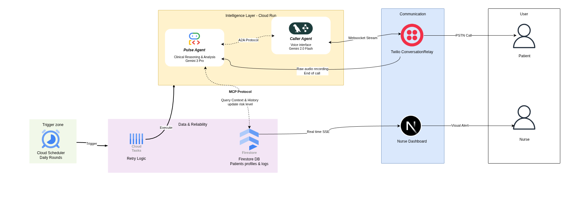
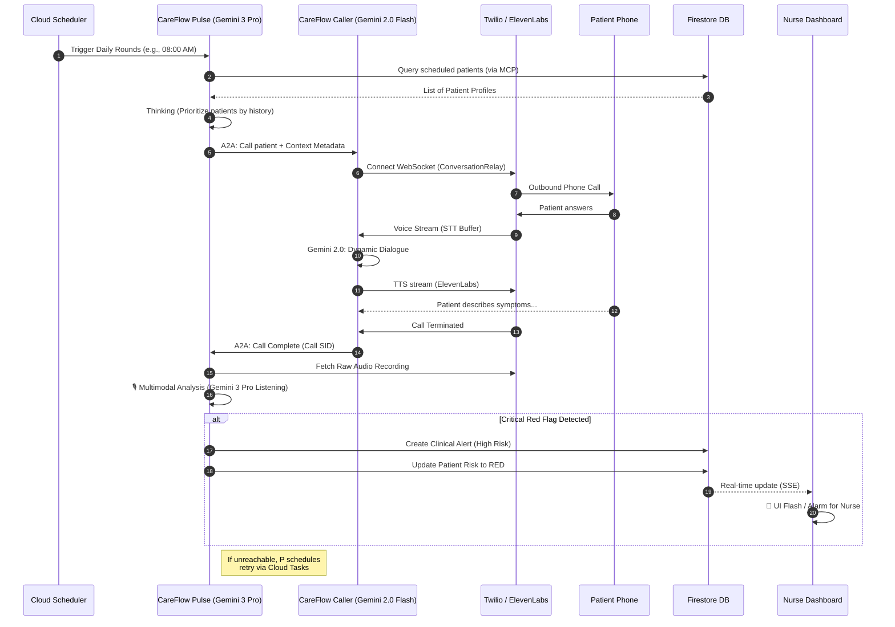

# 🏗️ System Architecture: CareFlow Pulse

This document details the technical architecture of **CareFlow Pulse**, a production-grade healthcare monitoring system built for the **Gemini 3 Hackathon**.

The system utilizes a specialized **Dual-Agent Architecture** where clinical reasoning and voice interaction are decoupled to optimize for both latency and complex reasoning.

---

## 1. High-Level Blueprint

The following diagram illustrates the macroscopic view of the CareFlow ecosystem.

---

## 2. End-to-End Call Flow (Sequence)

This sequence describes a typical "Daily Rounds" execution, starting from the automated trigger to the generation of a clinical alert.

---

## 3. Proactive Orchestration (Scheduler & Tasks)

CareFlow Pulse is not a passive system. It implements a **Proactive Care Cycle**:

1.  **Google Cloud Scheduler**: Triggers the `Pulse Agent` at 08:00 AM and 19:00 PM daily to initiate "Rounds". 
2.  **Intelligent Retries**: If a patient doesn't answer or the call fails, the `Pulse Agent` delegates a retry task to **Google Cloud Tasks** with an exponential backoff or specific timing (e.g., "retry in 2 hours").
3.  **Resilience**: This ensures that every discharged patient is reached, even if they were busy or asleep during the first attempt.

---

## 4. The AHRQ RED Framework

The system's clinical intelligence is grounded in the **Agency for Healthcare Research and Quality (AHRQ) Re-Engineered Discharge (RED)** toolkit. 

The **Pulse Agent** enforces the following RED components:
- **Medication Reconciliation**: Comparing patient's reported adherence with the discharge plan.
- **Symptom Education (Teach-Back)**: Verifying the patient knows when to call the doctor.
- **Upcoming Appointment Confirmation**: Ensuring the patient is prepared for follow-up care.
- **Red Flag Identification**: Immediate escalation of post-discharge complications.

---

## 5. The Dual-Agent Logic (A2A Protocol)

CareFlow Pulse separates **Cognition** from **Interaction**. This is done using the **Agent-to-Agent (A2A) protocol**.

| Agent | Model | Primary Responsibility | Key Tools |
| :--- | :--- | :--- | :--- |
| **Pulse Agent** | Gemini 3 Pro | High-level clinical reasoning, protocol adherence, data management. | MCP Firestore Toolbox, Cloud Tasks Scheduler. |
| **Caller Agent** | Gemini 2.0 Flash | Low-latency voice interaction, STT/TTS management, empathetic rapport. | Twilio Voice Relay, ElevenLabs TTS. |

---

## 4. Why Gemini 3 Multimodal?

Unlike traditional systems that analyze **transcripts**, CareFlow Pulse's Gemini 3 Pro listens to the **native audio recording**. This allows the agent to detect signals that text misses:

- **Breathlessness (Dyspnea)**: Detecting signs of respiratory distress between words via audible gasping or raspy vocal quality.
- **Cognitive & Social Context**: Detecting contradictions (background voices disagreeing with the patient) or identifying "cognitive fog" via slurred speech and long hesitations.
- **Environmental Safety**: Hearing **Medical Alarms** (O2 sensors/ventilator beeps) that the patient may be ignoring, or identifying **Emergency Sounds** like household falls (thuds, glass breaking).
- **Vocal Biomarkers**: Detecting vocal tremors or pain-induced grunting that signals physical distress despite the patient's verbal claims.

---

## 6. Security & Compliance Architecture

CareFlow Pulse implements an **AI Defense-in-Depth** strategy:

1. **Model Armor**: Every input and output passes through a HIPAA-aware proxy that sanitizes PII/PHI.
2. **Access Control**: Role-Based Access Control (RBAC) via Firebase Auth and Firestore Security Rules.
3. **Audit Trails**: Every interaction, tool call, and alert is logged into a dedicated Immutable Audit Log collection.
4. **Data Isolation**: Patients are isolated by Hospital ID at the database level.
