# 🏗️ System Architecture: CareFlow Pulse

This document details the technical architecture of **CareFlow Pulse**, a production-grade healthcare monitoring system built for the **Gemini 3 Hackathon**.

The system utilizes a specialized **Dual-Agent Architecture** where clinical reasoning and voice interaction are decoupled to optimize for both latency and complex reasoning.

---

## 1. High-Level Blueprint

The following diagram illustrates the macroscopic view of the CareFlow ecosystem, showcasing the integration between Google Cloud, Twilio, and the specialized agents.

---

## 2. End-to-End Call Flow (Sequence)

This sequence describes a typical "Daily Rounds" execution, starting from the automated trigger to the generation of a clinical alert.

```mermaid
sequenceDiagram
    autonumber
    participant S as Cloud Scheduler
    participant P as CareFlow Pulse (Gemini 3 Pro)
    participant C as CareFlow Caller (Gemini 2.0 Flash)
    participant T as Twilio / ElevenLabs
    participant Pt as Patient Phone
    participant F as Firestore DB
    participant D as Nurse Dashboard

    S->>P: Trigger Daily Rounds (e.g., 08:00 AM)
    P->>F: Query scheduled patients (via MCP)
    F-->>P: List of Patient Profiles
    P->>P: Thinking (Prioritize patients by history)
    
    P->>C: A2A: Call patient + Context Metadata
    C->>T: Connect WebSocket (ConversationRelay)
    T->>Pt: Outbound Phone Call
    Pt->>T: Patient answers
    T->>C: Voice Stream (STT Buffer)
    C->>C: Gemini 2.0: Dynamic Dialogue
    C->>T: TTS stream (ElevenLabs)
    Pt-->>C: Patient describes symptoms...
    
    T->>C: Call Terminated
    C->>P: A2A: Call Complete (Call SID)
    P->>T: Fetch Raw Audio Recording
    P->>P: 🎙️ Multimodal Analysis (Gemini 3 Pro Listening)
    
    alt Critical Red Flag Detected
        P->>F: Create Clinical Alert (High Risk)
        P->>F: Update Patient Risk to RED
        F-->>D: Real-time update (SSE)
        D->>D: 🚨 UI Flash / Alarm for Nurse
    end
```

---

## 3. The Dual-Agent Logic (A2A Protocol)

CareFlow Pulse separates **Cognition** from **Interaction**. This is done using the **Agent-to-Agent (A2A) protocol**.

| Agent | Model | Primary Responsibility | Key Tools |
| :--- | :--- | :--- | :--- |
| **Pulse Agent** | Gemini 3 Pro | High-level clinical reasoning, protocol adherence, data management. | MCP Firestore Toolbox, Cloud Tasks Scheduler. |
| **Caller Agent**| Gemini 2.0 Flash| Low-latency voice interaction, STT/TTS management, empathetic rapport. | Twilio Voice Relay, ElevenLabs TTS. |

---

## 4. Why Gemini 3 Multimodal?

Unlike traditional systems that analyze **transcripts**, CareFlow Pulse's Gemini 3 Pro listens to the **native audio recording**. This allows the agent to detect signals that text misses:

- **Breathlessness (Dyspnea)**: Detecting signs of respiratory distress between words.
- **Cognitive Fog**: Measuring hesitation patterns or confusion during medication review.
- **Mental Health**: Detecting vocal tremors or distress signals missed by text.

---

## 6. Security & Compliance Architecture

CareFlow Pulse implements an **AI Defense-in-Depth** strategy:

1. **Model Armor**: Every input and output passes through a HIPAA-aware proxy that sanitizes PII/PHI.
2. **Access Control**: Role-Based Access Control (RBAC) via Firebase Auth and Firestore Security Rules.
3. **Audit Trails**: Every interaction, tool call, and alert is logged into a dedicated Immutable Audit Log collection.
4. **Data Isolation**: Patients are isolated by Hospital ID at the database level.
