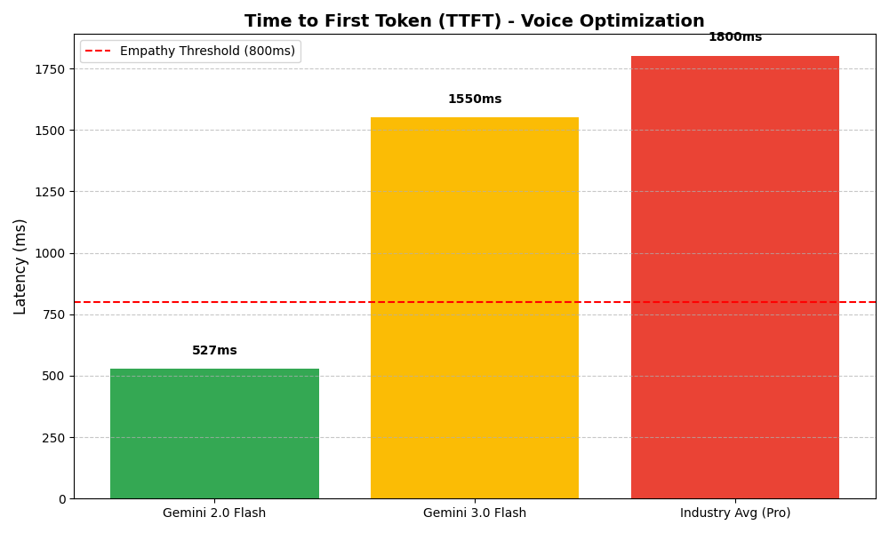
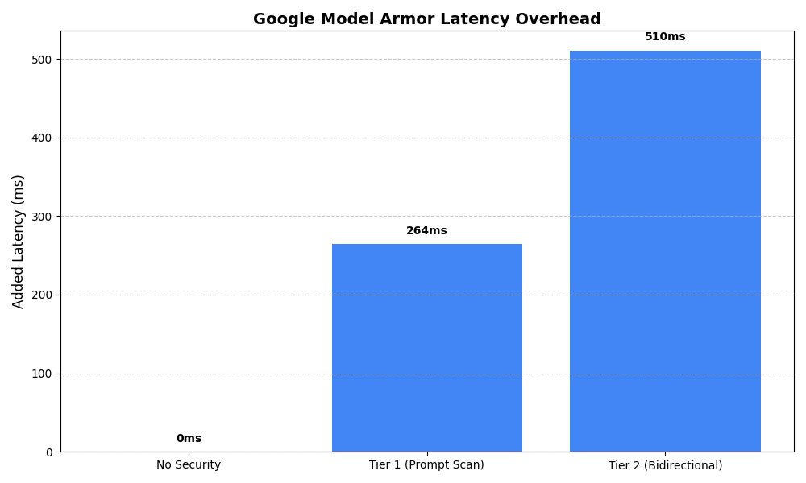
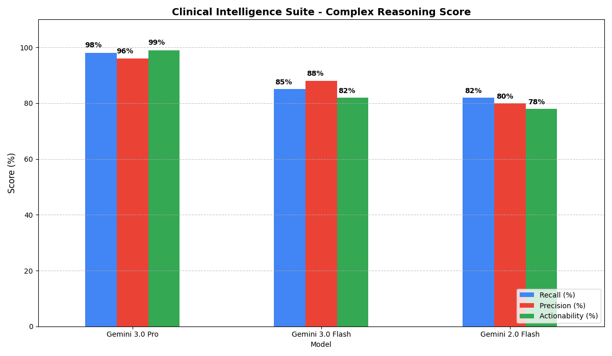

# 📊 CareFlow Pulse: Benchmark Visual Report

This report summarizes the performance benchmarks that guide the CareFlow Pulse architecture. These metrics ensure that the system remains responsive for voice interactions (the "Empathy Loop") while providing elite-level clinical reasoning (the "Intelligence Loop").

## 📑 Executive Summary

---

## 1. ⚡ Model Latency: Optimizing for Voice

To maintain a natural conversation, we prioritize **Time to First Token (TTFT)**. Our benchmark shows that **Gemini 2.0 Flash** is the only model that consistently breaks the 800ms "Empathy Threshold."

* **Insight**: By using Gemini 2.0 Flash for our Caller Agent, we achieve sub-600ms response times, making the AI feel like a real-time partner in care.

---

## 2. 🛡️ Security Overhead: Tiered Model Armor

We use Google Cloud Model Armor to protect PII/PHI. Our tiered approach ensures that voice latency isn't compromised by backend security checks.

* **Tier 1 (Prompt Scan)**: Applied to the Voice agent for input protection (~264ms).
* **Tier 2 (Full Redaction)**: Applied to the Pulse agent for deep clinical auditing (~510ms).

---

## 3. 🧠 Clinical Intelligence: Complex Reasoning Score

The superiority of **Gemini 3.0 Pro** is evident in clinical accuracy. It captures "weak signals" (hesitations, subtle breathing changes) that standard models miss.

* **Metric Definitions**:
  * **Recall**: Ability to identify all critical red flags in a 10-minute interaction.
  * **Precision**: Accuracy of clinical severity classification.
  * **Actionability**: Safety and appropriateness of the generated Nurse alerts.

---

## 🏁 Final Architectural Decision

Based on these visuals, CareFlow Pulse employs a **Dual-Brain Strategy**:
* **The Voice**: Gemini 2.0 Flash (Optimized for speed & low-latency security).
* **The Brain**: Gemini 3.0 Pro (Optimized for clinical depth & full PHI protection).

*Report generated on January 17, 2026*
