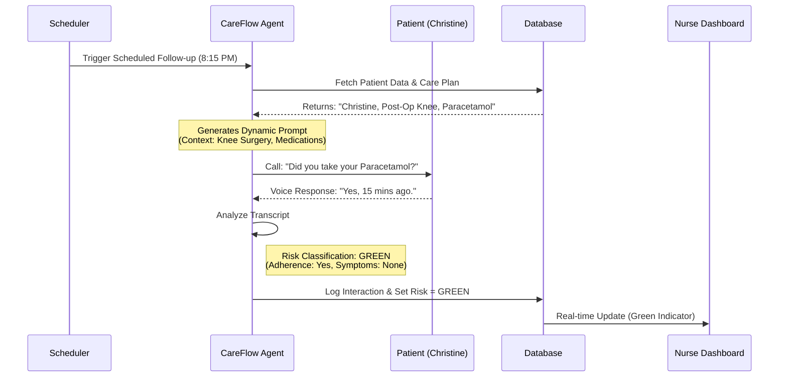
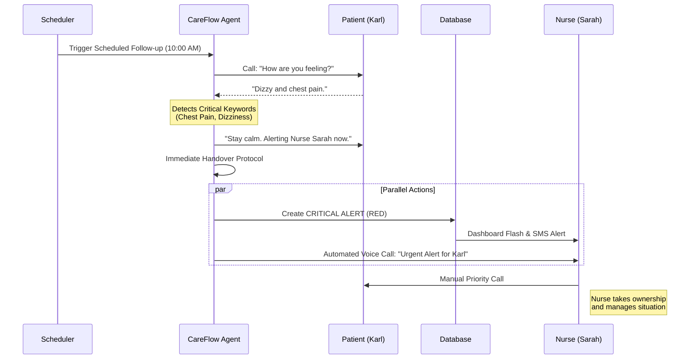

# **CareFlow Pulse: Functional Specifications (v2.0)**

| | |
| :--- | :--- |
| **Document Version:** | 2.0 |
| **Date:** | 2025-12-24 |
| **Status:** | **Approved** |
| **Author:** | Christ |

---

### **Revision History**
| Version | Date | Author | Changes |
| :--- | :--- | :--- | :--- |
| 1.0 | 2025-12-20 | Christ | Initial Draft |
| 1.1 | 2025-12-22 | Christ | Incorporated feedback on handover protocol. |
| 2.0 | 2025-12-24 | Christ | Comprehensive rewrite: Added Mission, Personas, and detailed User Stories. Expanded all sections for clarity. |

---

## 1. Introduction: The Vision for Proactive Post-Hospitalization Care

### 1.1. The Problem: The Revolving Door of Hospital Readmissions

In today's healthcare landscape, the 30 days following a patient's discharge from the hospital are a critical and vulnerable period. A significant percentage of patients are readmitted within this window, leading to poorer health outcomes, immense stress for patients and their families, and billions of dollars in costs to the healthcare system.

Nurse coordinators are on the front lines of this battle, tasked with monitoring dozens, if not hundreds, of recently discharged patients. This manual process is often overwhelming, inefficient, and prone to human error. Critical warning signs can be missed in the noise of routine check-ins, and nurses spend valuable time on stable patients instead of focusing on those who are most at-risk.

### 1.2. The Solution: CareFlow Pulse

**CareFlow Pulse** is an AI-powered, proactive monitoring system designed to serve as a dedicated, intelligent assistant for nurse coordinators. Our mission is to **break the cycle of hospital readmissions** by automating routine patient follow-ups and intelligently triaging alerts, ensuring that human expertise is applied precisely where it is needed most.

The system is not just a tool; it is designed to be an empathetic and integrated member of the care team. It communicates with patients in a natural, helpful manner and delivers clear, concise, and actionable insights to healthcare professionals, transforming post-hospitalization care from a reactive chore into a proactive, life-saving process.

#### **High-Level Solution Architecture**

```mermaid
graph TD
    %% Actors
    Patient((Patient))
    Nurse((Nurse Coordinator))

    %% System Components
    subgraph "CareFlow Pulse System"
        Scheduler[Cloud Scheduler]
        Dispatcher[Dispatcher Service]
        
        subgraph "AI Agent Fleet"
            PulseAgent[CareFlow Pulse Agent<br/>(Medical Intelligence)]
            CallerAgent[Note: Voice Interface handled via Twilio<br/>(Caller Agent)]
        end
        
        Database[(Firestore Database)]
        Dashboard[Nurse Dashboard]
    end

    %% Flow
    Scheduler -->|Trigger Daily Rounds| Dispatcher
    Dispatcher -->|Start Job| PulseAgent
    PulseAgent -->|Retrieve Plans| Database
    PulseAgent -->|Initiate Call| CallerAgent
    CallerAgent <-->|Voice Call| Patient
    
    CallerAgent -->|Transcript & Analysis| PulseAgent
    PulseAgent -->|Update Risk & Alerts| Database
    Database -->|Real-time Sync| Dashboard
    
    Dashboard -->|View Alerts| Nurse
    Nurse -->|Manual Intervention| Patient
    
    %% Styling
    style Patient fill:#e1f5fe,stroke:#01579b
    style Nurse fill:#e1f5fe,stroke:#01579b
    style PulseAgent fill:#f3e5f5,stroke:#4a148c
    style Dashboard fill:#e8f5e9,stroke:#1b5e20
    style Database fill:#fff3e0,stroke:#e65100
```

### 1.3. Scope of the System

- **In Scope:** Automated, scheduled patient follow-ups via Voice and SMS; analysis of patient responses; risk classification; real-time dashboard for nurses; alert management and assignment.
- **Out of Scope (for v1.0):** Direct integration with Electronic Health Record (EHR) systems; billing and insurance processing; patient-facing mobile application.

---

## 2. User Personas & Stories

### 2.1. Persona: The Nurse Coordinator

- **Name:** Sarah, RN
- **Role:** Post-Discharge Care Coordinator
- **Workload:** Manages a caseload of 80-100 recently discharged patients.
- **Goals:** Prevent readmissions, ensure patients adhere to their care plans, and focus her limited time on the most critical cases.
- **Frustrations:** "I spend most of my day making routine calls to patients who are doing fine. I'm constantly worried that while I'm on a routine call, a critical patient's condition is worsening. I need a way to filter out the noise and find the signal."

### 2.2. Persona: The Patient

- **Name:** Christine (Patient ID: 123899)
- **Condition:** Recovering from minor knee surgery. Low-risk.
- **Needs:** Gentle reminders and confirmation that she is on the right track with her simple recovery plan.

- **Name:** Karl (Patient ID: 456789)
- **Condition:** Recently discharged after an acute cardiac event. High-risk.
- **Needs:** Close monitoring for specific critical symptoms and a clear, immediate path to his care team if issues arise.

---

## 3. Detailed User Stories & System Behavior

### 3.1. User Story 1: The "Green Path" - A Successful Follow-up with Christine

**As Nurse Sarah, I want the system to handle routine check-ins automatically, so I can be confident that stable patients like Christine are being monitored without taking up my time.**

**Scenario:**
- **Patient:** Christine (ID: 123899)
- **Discharge Date:** September 12, 2025
- **Care Plan:** Take one dose of Paracetamol for pain management every evening at 8:00 PM.
- **Scheduled Follow-up:** D+3, September 15, 2025, at 8:15 PM.

**Execution Flow:**
1.  **Trigger (8:15 PM):** The system's scheduler initiates a follow-up for Christine.
2.  **Agent Action (Connect):** The `CareFlow-Connect` agent generates a dynamic prompt and initiates a voice call via Twilio.
3.  **The Call:**
    - **Agent:** "Hello Christine, this is your CareFlow assistant calling to check in on your recovery. The schedule notes it was time for your evening Paracetamol. Were you able to take it?"
    - **Christine:** "Oh, hello! Yes, I took it about 15 minutes ago."
    - **Agent:** "That's great to hear. And how are you feeling overall? Any unusual pain or swelling in your knee?"
    - **Christine:** "No, it feels much better today, actually. Just a little stiff."
    - **Agent:** "Excellent. I've noted that down. Remember to continue your gentle exercises. We'll check in again in a few days. Have a restful evening!"
4.  **Agent Action (Analyze & Log):**
    - The call ends. The `CareFlow-Analyze` agent receives the transcript.
    - It determines there are no risk factors. It classifies the interaction as **`GREEN`**.
    - It writes the call summary and transcript to Christine's `interactionLog` in Firestore.
5.  **Nurse Interface:**
    - On her dashboard, Nurse Sarah sees Christine's status update to `GREEN` with a timestamp. She doesn't receive an alert and can continue focusing on other patients, confident that Christine's check-in was successful.

#### **Sequence Diagram: Automated Check-in (Green Path)**



### 3.2. User Story 2: The "Red Path" - A Critical Alert with Karl

**As Nurse Sarah, I need the system to immediately notify me and provide clear context when a high-risk patient like Karl shows critical symptoms, so I can intervene before it's too late.**

**Scenario:**
- **Patient:** Karl (ID: 456789)
- **Discharge Date:** November 10, 2025 (Cardiac Event)
- **Care Plan:** Monitor for chest pain, shortness of breath, and dizziness.
- **Scheduled Follow-up:** D+5, November 15, 2025, at 10:00 AM.

**Execution Flow:**
1.  **Trigger (10:00 AM):** The scheduler initiates a follow-up for Karl.
2.  **Agent Action (Connect):** The agent initiates a voice call.
3.  **The Call:**
    - **Agent:** "Good morning Karl, this is your CareFlow assistant calling for your daily check-in. How are you feeling today?"
    - **Karl:** "Not so good. I've been feeling quite dizzy this morning, and... and I have a slight pain in my chest."
4.  **Agent Action (Immediate Analysis & Handover):**
    - The agent's prompt has defined "dizzy" and "chest pain" as critical keywords for a cardiac patient.
    - It immediately switches to the **Safe Handover Protocol**.
    - **Agent:** "Thank you for telling me that, Karl. I've noted it down. For your safety, it's very important that you speak directly with your nurse about these symptoms. **I am connecting with Nurse Sarah right now to alert her.** She will call you back on this number very shortly. If you feel your condition is worsening, please hang up and dial 911."
5.  **Agent Action (Alert Generation):**
    - The agent ends the call with Karl.
    - It immediately sets Karl's `riskLevel` in Firestore to **`RED`**.
    - It populates the `alert` field with: `{ "isCritical": true, "reason": "Patient reports dizziness and chest pain.", "timestamp": "..." }`.
    - The `CareFlow-Brief` agent generates a concise summary: *"Patient Karl reported dizziness and chest pain during scheduled check-in. Advised that his nurse would call him back."*
6.  **Nurse Interface (Real-Time Update):**
    - Nurse Sarah's dashboard instantly updates. Karl's entry shoots to the top of her list, highlighted in red. She sees the `aiBrief` and knows exactly what's wrong.
7.  **Agent Action (Proactive Nurse Contact):**
    - Simultaneously, the `CareFlow-Main` agent, having identified a `RED` alert, uses its `twilio_voice_call` tool to call Nurse Sarah's direct line.
    - **Automated Call to Nurse:** "This is a critical alert from CareFlow Pulse. Patient Karl is reporting dizziness and chest pain. Please review his file in the dashboard and contact him immediately."
8.  **Human Intervention:**
    - Nurse Sarah, already looking at Karl's file, clicks "Take Ownership" on the alert and immediately calls Karl, armed with all the necessary context.

#### **Sequence Diagram: Critical Escalation (Red Path)**



---

## 4. Functional Requirements Deep Dive

### FS-1: Patient & Follow-up Lifecycle Management
| ID | Feature | Description |
| :--- | :--- | :--- |
| **FS-1.1** | **Session Initialization** | A new patient follow-up session is created from their digital Discharge Plan. The system defines a schedule for automated check-ins (e.g., D+1, D+3, D+7). |
| **FS-1.2** | **Scheduled Follow-up** | At the scheduled time, the system automatically initiates patient contact via the preferred method (Voice Call or SMS). |
| **FS-1.3** | **Risk Triage & Analysis** | The agent analyzes the patient's response to classify the risk level: **GREEN** (Stable), **ORANGE** (Warning), or **RED** (Critical). |
| **FS-1.4** | **Auditable History** | Every interaction is logged chronologically in the patient's `interactionLog` for clinical review and audit purposes. |

### FS-2: Patient Communication Interface
| ID | Feature | Description |
| :--- | :--- | :--- |
| **FS-2.1** | **Dynamic Prompt Generation** | Before each interaction, the agent generates a unique prompt including the patient's name, specific medications for that check-in, and known critical symptoms. |
| **FS-2.2** | **Fluid Conversation** | The specialized Voice Agent service manages real-time STT/TTS and allows the patient to interrupt (barge-in) for a natural conversation flow. |
| **FS-2.3** | **Two-Tiered Alerting** | **Tier 1 (Immediate):** The Voice Agent can trigger an instant webhook for unambiguous, life-threatening keywords. **Tier 2 (Contextual):** For all other cases, the full transcript is analyzed by the ADK Agent for more nuanced risk assessment. |
| **FS-2.4** | **Safe Handover Protocol** | If a patient asks for medical advice, the agent must use the "Consulting the Care Team" script, explicitly stating it will contact the nurse and never providing advice itself. |

### FS-3: Nurse Coordinator Interface
| ID | Feature | Description |
| :--- | :--- | :--- |
| **FS-3.1** | **Real-Time Dashboard** | The dashboard displays all patient sessions, sorted by `riskLevel` (RED > ORANGE > GREEN), and updates instantly via a real-time connection to the database. |
| **FS-3.2** | **Comprehensive Patient File** | A detailed view containing the Discharge Plan, the complete `interactionLog`, and the latest AI-generated summary (`aiBrief`). |
| **FS-3.3** | **Alert Triage & Assignment** | A nurse can click to "Take Ownership" of an alert, which updates its status and notifies the team that it is being handled. |
